## Advanced Lane Finding Project

The goals / steps of this project are the following:

* Compute the camera calibration matrix and distortion coefficients given a set of chessboard images.
* Apply a distortion correction to raw images.
* Use color transforms, gradients, etc., to create a thresholded binary image.
* Apply a perspective transform to rectify binary image ("birds-eye view").
* Detect lane pixels and fit to find the lane boundary.
* Determine the curvature of the lane and vehicle position with respect to center.
* Warp the detected lane boundaries back onto the original image.
* Output visual display of the lane boundaries and numerical estimation of lane curvature and vehicle position.

## Camera Calibration using chessboard images


```python
images = glob.glob('./camera_cal/calibration*.jpg')
```


```python
mtx, dist = calibration.camera_calibration(images, 6, 9)
```

## Undistorted chessboard Image


```python
img = cv2.imread('./camera_cal/calibration1.jpg')
undistorted_img = cv2.undistort(img, mtx, dist, None, mtx)
    
helpers.plt_images(img, 'Source image', undistorted_img, 'Undistorted image')
```


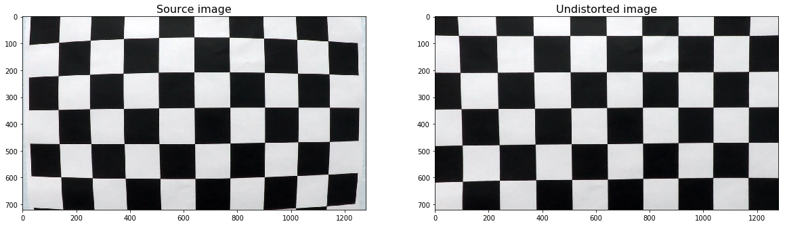


## Create a thresholded binary image


```python
image = cv2.imread('./test_images/test1.jpg')
image = cv2.cvtColor(image, cv2.COLOR_BGR2RGB)
image = cv2.undistort(image, mtx, dist, None, mtx)

plt.imshow(image)
```


    <matplotlib.image.AxesImage at 0x102f994a8>


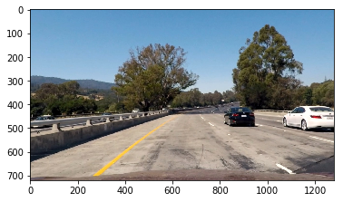


### 1- Directional gradient


```python
grad_x = threshold.abs_sobel_thresh(image, orient='x', thresh=(30, 100))
helpers.plt_images(image, 'Source image', grad_x, 'Directional gradient')
```


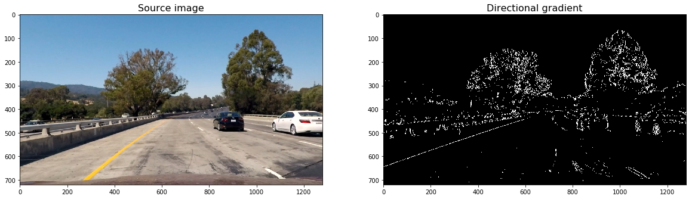


```python
grad_y = threshold.abs_sobel_thresh(image, orient='y', thresh=(30, 100))
helpers.plt_images(image, 'Source image', grad_y, 'Directional gradient')
```


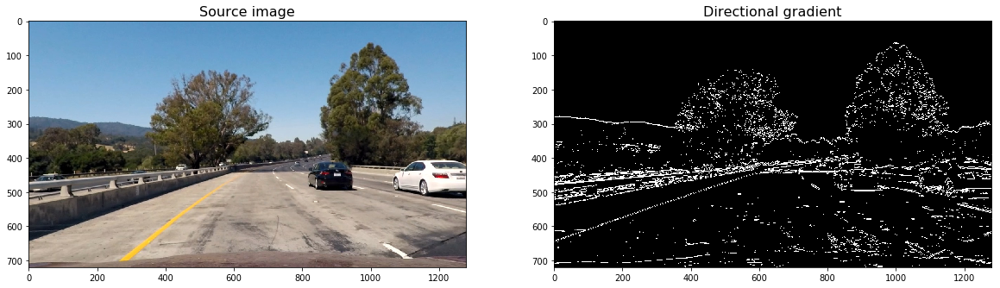


### 2- Gradient magnitude


```python
mag_binary = threshold.mag_thresh(image, sobel_kernel=3, thresh=(70, 100))
helpers.plt_images(image, 'Source image', mag_binary, 'Gradient magnitude')
```


### 3- Gradient direction


```python
dir_binary = threshold.dir_threshold(image, sobel_kernel=15, thresh=(0.7, 1.3))
helpers.plt_images(image, 'Source image', dir_binary, 'Gradient direction')
```


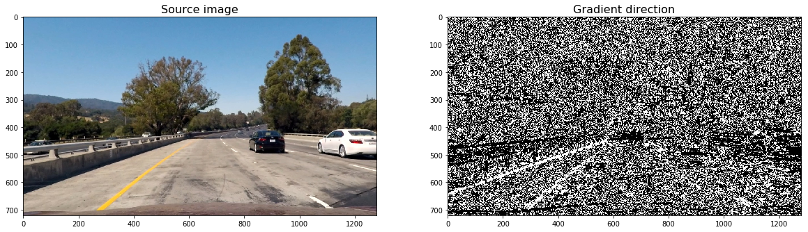


### 4- Color threshold


```python
col_binary = threshold.col_thresh(image, thresh=(170, 255))
helpers.plt_images(image, 'Source image', col_binary, 'Gradient direction')
```


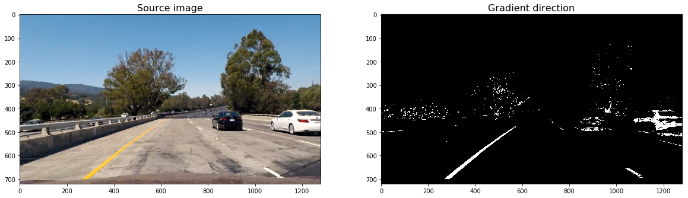


### 5- Combined thresholds


```python
combined = threshold.combine_threshs(grad_x, grad_y, mag_binary, dir_binary, col_binary, ksize=15)
helpers.plt_images(image, 'Source image', combined, 'Combined thresholds')
```


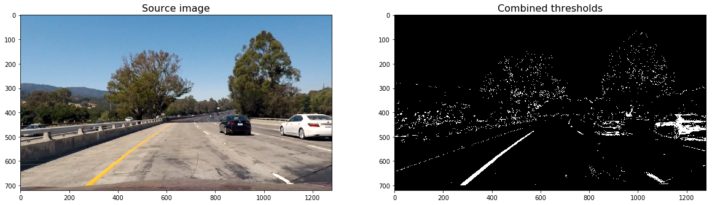


## Apply a perspective transform to rectify binary image ("birds-eye view")


```python
src_coordinates = np.float32(
    [[280,  700],  # Bottom left
     [595,  460],  # Top left
     [725,  460],  # Top right
     [1125, 700]]) # Bottom right

dst_coordinates = np.float32(
    [[250,  720],  # Bottom left
     [250,    0],  # Top left
     [1065,   0],  # Top right
     [1065, 720]]) # Bottom right 

warped_img, _ , Minv  = warp.warp(image, src_coordinates, dst_coordinates)
# Visualize undirstorsion
f, (ax1, ax2) = plt.subplots(1, 2, figsize=(20,10))
ax1.set_title('Undistorted image with source points drawn', fontsize=16)
ax1.plot(Polygon(src_coordinates).get_xy()[:, 0], Polygon(src_coordinates).get_xy()[:, 1], color='red')
ax1.imshow(image)

ax2.set_title('Warped image with destination points drawn', fontsize=16)
ax2.plot(Polygon(dst_coordinates).get_xy()[:, 0], Polygon(dst_coordinates).get_xy()[:, 1], color='red')
ax2.imshow(warped_img)
```


    <matplotlib.image.AxesImage at 0x102e68470>


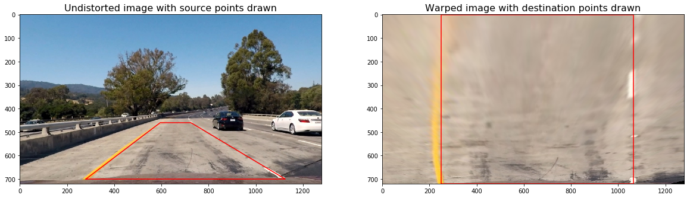


## Detect lane pixels and fit to find the lane boundary

### Create Histogram


```python
# Run de function over the combined warped image
combined_warped = warp.warp(combined)[0]
histogram = helpers.get_histogram(combined_warped)

# Plot the results
plt.title('Histogram', fontsize=16)
plt.xlabel('Pixel position')
plt.ylabel('Counts')
plt.plot(histogram)
```


    [<matplotlib.lines.Line2D at 0x102c0a5c0>]


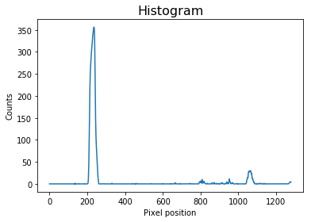


### Detect Lines


```python
lines_fit, left_points, right_points, out_img = lines.detect_lines(combined_warped, return_img=True)
helpers.plt_images(warped_img, 'Warped image', out_img, 'Lane lines detected')
```


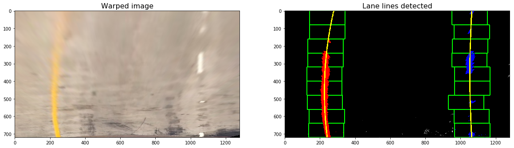


### Detect Similar Lines


```python
lines_fit, left_points, right_points, out_img = lines.detect_similar_lines(combined_warped, lines_fit, return_img=True)
helpers.plt_images(warped_img, 'Warped image', out_img, 'Lane lines detected')

```

    Clipping input data to the valid range for imshow with RGB data ([0..1] for floats or [0..255] for integers).


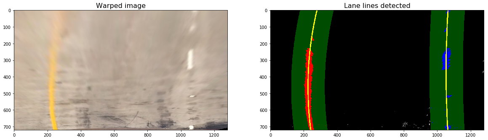


## Determine the curvature of the lane and vehicle position with respect to center

### Calculate Curvature Radius


```python
curvature_rads = lines.curvature_radius(leftx=left_points[0], rightx=right_points[0], img_shape = img.shape)
print('Left line curvature:', curvature_rads[0], 'm')
print('Right line curvature:', curvature_rads[1], 'm')
```

    Left line curvature: 518.4476261684651 m
    Right line curvature: 1558.810189537155 m


### Calculate Car Offset


```python
offsetx = lines.car_offset(leftx=left_points[0], rightx=right_points[0], img_shape=img.shape)
print ('Car offset from center:', offsetx, 'm.')
```

    Car offset from center: -0.0560041662700661 m.


## Warp the detected lane boundaries back onto the original image

### Draw Lane


```python
img_lane = draw.draw_lane(image, combined_warped, left_points, right_points, Minv)
helpers.plt_images(image, 'Test image', img_lane, 'Lane detected')
```


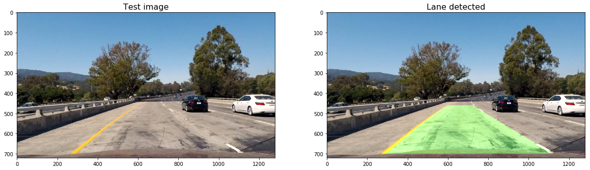


### Add Metrics


```python
out_img = draw.add_metrics(img_lane, leftx=left_points[0], rightx=right_points[0])
helpers.plt_images(image, 'Test image', out_img, 'Lane detected with metrics')
```


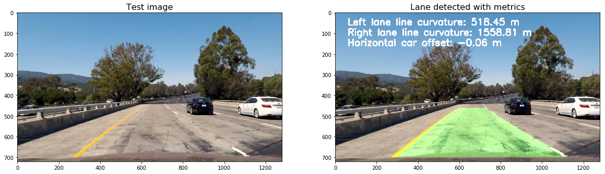


## Output visual display of the lane boundaries and numerical estimation of lane curvature and vehicle position video


```python
class ProcessImage:
    def __init__(self, images):
        # Make a list of calibration images
        images = glob.glob(images)

        # Calibrate camera
        self.mtx, self.dist = calibration.camera_calibration(images, 6, 9)
        self.lines_fit = None

    def __call__(self, img):
        # Undistord image
        img = cv2.undistort(img, mtx, dist, None, mtx)

        # Calculate directional gradient
        grad_binary = threshold.abs_sobel_thresh(img, orient='x', sobel_kernel=15, thresh=(30, 100))

        # Calculate gradient magnitude 
        mag_binary = threshold.mag_thresh(img, sobel_kernel=15, thresh=(50, 100))

        # Calculate gradient direction
        dir_binary = threshold.dir_threshold(img, sobel_kernel=15, thresh=(0.7, 1.3))

        # Calculate color threshold
        col_binary = threshold.col_thresh(img, thresh=(170, 255))

        # Combine all the thresholds to identify the lane lines
        combined = threshold.combine_threshs(grad_x, grad_y, mag_binary, dir_binary, col_binary, ksize=15)

        # Apply a perspective transform to rectify binary image ("birds-eye view")
        src_coordinates = np.float32(
            [[280,  700],  # Bottom left
             [595,  460],  # Top left
             [725,  460],  # Top right
             [1125, 700]]) # Bottom right

        dst_coordinates = np.float32(
            [[250,  720],  # Bottom left
             [250,    0],  # Top left
             [1065,   0],  # Top right
             [1065, 720]]) # Bottom right   

        combined_warped, _, Minv = warp.warp(combined, src_coordinates, dst_coordinates)
                
        self.lines_fit, left_points, right_points, out_img = lines.detect_similar_lines(combined_warped, self.lines_fit, return_img=True)

        # Warp the detected lane boundaries back onto the original image.
        img_lane = draw.draw_lane(img, combined_warped, left_points, right_points, Minv)
            
        # Add metrics to the output img
        out_img = draw.add_metrics(img_lane, leftx=left_points[0], rightx=right_points[0])
            
        return out_img
```

<iframe width="560" height="315" src="https://www.youtube.com/embed/KkXkgypdUak" frameborder="0" allow="accelerometer; autoplay; encrypted-media; gyroscope; picture-in-picture" allowfullscreen></iframe>

<video width="640" height="360" controls>
  <source src="./project_video_solution.mp4" type="video/mp4">
</video>
